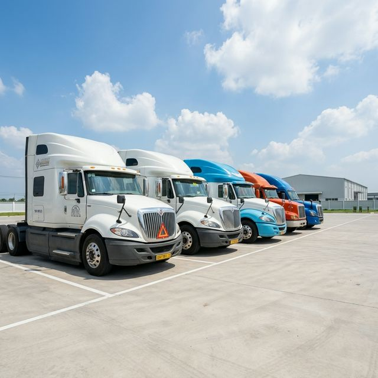

# 🔍 Báo Cáo Kiểm Tra Toàn Diện — Website CHL Logistics

> **Ngày quét:** 07/04/2026 | **Phạm vi:** Toàn bộ dự án (index.html, styles.css, script.js)

---

## 📊 Tổng Quan Nhanh

| Hạng Mục | Trạng Thái | Mức Độ |
|----------|-----------|--------|
| 🔴 Lỗi Chức Năng (Bug) | **1 lỗi nghiêm trọng** | Critical |
| 🟠 SEO | **6 vấn đề** | High |
| 🟡 Accessibility (Truy cập) | **5 vấn đề** | Medium-High |
| 🟡 Performance (Hiệu năng) | **4 vấn đề** | Medium |
| 🔵 UX/Design (Thiết kế) | **5 cải thiện** | Medium |
| ⚫ Security (Bảo mật) | **2 vấn đề** | Low-Medium |

---

## 🔴 1. Lỗi Nghiêm Trọng (Critical Bugs)

### 1.1 ❌ Mobile Menu Không Hoạt Động
**Mức độ: CRITICAL** — Ảnh hưởng trực tiếp đến khả năng điều hướng trên di động.

**Hiện trạng:** Nút hamburger menu (☰) hiển thị trên mobile nhưng khi bấm **không xảy ra gì**. Không có JavaScript handler nào xử lý sự kiện click.

**File ảnh hưởng:** script.js, styles.css

**Cần bổ sung JS:**
```js
// Mobile Menu Toggle
const mobileMenuBtn = document.querySelector('.mobile-menu-btn');
const navLinks = document.querySelector('.nav-links');

mobileMenuBtn.addEventListener('click', () => {
    navLinks.classList.toggle('active');
    mobileMenuBtn.classList.toggle('active');
});
```

**CSS cần thêm:**
```css
.nav-links.active {
    display: flex;
    flex-direction: column;
    position: absolute;
    top: 100%;
    left: 0;
    width: 100%;
    background: var(--navy);
    padding: 20px;
    border-bottom: 1px solid var(--glass-border);
}
```

---

## 🟠 2. SEO Issues (6 vấn đề)

### 2.1 ❌ Thiếu Open Graph & Social Meta Tags
Khi chia sẻ link lên Facebook/Zalo/LinkedIn sẽ **không có preview ảnh/mô tả**.

```html
<meta property="og:title" content="C.H.L Logistics - Vận Tải Container Cho Forwarder">
<meta property="og:description" content="Đơn vị hàng đầu cung cấp dịch vụ vận tải container chuyên nghiệp tại TP.HCM">
<meta property="og:image" content="https://chl.vn/hero-bg.png">
<meta property="og:url" content="https://chl.vn">
<meta property="og:type" content="website">
```

### 2.2 ❌ Thiếu Favicon
Trình duyệt hiển thị icon mặc định → **thiếu chuyên nghiệp**.

```html
<link rel="icon" type="image/png" href="/favicon.png">
<link rel="apple-touch-icon" href="/apple-touch-icon.png">
```

### 2.3 ❌ Thiếu Schema Markup (Structured Data)
Google không thể hiểu đây là doanh nghiệp → **mất cơ hội hiển thị rich snippet**.

```html
<script type="application/ld+json">
{
  "@context": "https://schema.org",
  "@type": "TransportationService",
  "name": "C.H.L Logistics",
  "telephone": "+84949968958",
  "email": "nguyenanhchl.hcm@gmail.com",
  "address": {
    "@type": "PostalAddress",
    "streetAddress": "133 KDC Phú Xuân",
    "addressLocality": "Nhà Bè",
    "addressRegion": "TP.HCM",
    "addressCountry": "VN"
  },
  "areaServed": "Hồ Chí Minh",
  "availableLanguage": "Vietnamese"
}
</script>
```

### 2.4 ⚠️ Thiếu Canonical URL
```html
<link rel="canonical" href="https://chl.vn/">
```

### 2.5 ⚠️ Thiếu `robots.txt` và `sitemap.xml`
Cần tạo 2 file này cho SEO crawling.

### 2.6 ⚠️ Thiếu Keyword Meta (phụ)
```html
<meta name="keywords" content="vận tải container, kéo container, forwarder, logistics TP.HCM, CHL">
<meta name="author" content="C.H.L Logistics">
<meta name="robots" content="index, follow">
```

---

## 🟡 3. Accessibility (5 vấn đề)

### 3.1 ✅ `lang` Attribute — Đã đúng (`lang="vi"`)

### 3.2 ❌ Thiếu Skip Navigation Link
Người dùng screen reader **không thể nhảy qua menu**.
```html
<a href="#home" class="skip-link">Bỏ qua đến nội dung chính</a>
```

### 3.3 ❌ Alt Text Chưa Đủ
Logo có `alt="[Ảnh Logo Ở Đây]"` — đây là **placeholder text**, cần thay bằng mô tả thực tế:
```diff
- 
+ 
```

### 3.4 ⚠️ Thiếu ARIA Labels cho Interactive Elements
```diff
- <div class="mobile-menu-btn">
+ <button class="mobile-menu-btn" aria-label="Mở menu điều hướng" aria-expanded="false">
```

### 3.5 ⚠️ Thiếu Focus Styles rõ ràng
Người dùng keyboard không nhìn thấy phần tử đang focus.
```css
*:focus-visible {
    outline: 2px solid var(--primary);
    outline-offset: 2px;
}
```

---

## 🟡 4. Performance (4 vấn đề)

### 4.1 ⚠️ Google Fonts Load Chặn Render
Font hiện tải **render-blocking**. Chuyển sang preload:
```html
<link rel="preconnect" href="https://fonts.googleapis.com">
<link rel="preconnect" href="https://fonts.gstatic.com" crossorigin>
<link href="https://fonts.googleapis.com/css2?..." rel="stylesheet" media="print" onload="this.media='all'">
```

### 4.2 ⚠️ Lucide Icons Load Toàn Bộ Thư Viện
Trang chỉ dùng ~8 icons nhưng load **toàn bộ Lucide** (~150KB). Nên chỉ import các icon cần dùng.

### 4.3 ⚠️ Ảnh Chưa Có Lazy Loading
```diff
- 
+ 
```

### 4.4 ⚠️ CDN Không Pin Version
```diff
- <script src="https://unpkg.com/lucide@latest"></script>
+ <script src="https://unpkg.com/lucide@0.344.0"></script>
```
Dùng `@latest` có thể gây **breaking changes** bất ngờ.

---

## 🔵 5. UX/Design Improvements (5 cải thiện)

### 5.1 💡 Thiếu Scroll Animation (Intersection Observer)
Các section hiện **xuất hiện đột ngột** khi scroll. Thêm fade-in effect sẽ tạo cảm giác mượt hơn.

### 5.2 💡 Thiếu Nút "Back to Top"
Trang dài, nên có nút cuộn về đầu trang.

### 5.3 💡 Thiếu Social Proof / Testimonials
Website logistics B2B **RẤT cần** phần đánh giá khách hàng / số liệu thống kê (số chuyến hàng, số đối tác...).

### 5.4 💡 Thiếu Section "Đội Xe" Chi Tiết
Hiện chỉ có 1 ảnh. Nên thêm gallery/carousel giới thiệu đội xe.

### 5.5 💡 Footer Thiếu Social Links
Không có link Facebook, Zalo, hoặc bản đồ Google Maps.

---

## ⚫ 6. Security (2 vấn đề)

### 6.1 ⚠️ Thiếu `rel="noopener noreferrer"` Cho External Links

### 6.2 ⚠️ Thiếu Content Security Policy (CSP)
```html
<meta http-equiv="Content-Security-Policy" content="default-src 'self'; script-src 'self' https://unpkg.com; style-src 'self' https://fonts.googleapis.com; font-src https://fonts.gstatic.com;">
```

---

## 📋 Thứ Tự Ưu Tiên Sửa

| # | Hạng Mục | Mức Độ | Thời Gian Ước Tính |
|---|----------|--------|---------------------|
| 1 | 🔴 Fix Mobile Menu | Critical | ~15 phút |
| 2 | 🟠 Fix Alt Text Placeholder | High | ~2 phút |
| 3 | 🟠 Thêm Open Graph Tags | High | ~5 phút |
| 4 | 🟠 Thêm Schema Markup | High | ~10 phút |
| 5 | 🟡 Thêm Favicon | Medium | ~5 phút |
| 6 | 🟡 Fix Accessibility (ARIA, Focus, Skip) | Medium | ~15 phút |
| 7 | 🟡 Optimize Performance (Fonts, Lazy) | Medium | ~10 phút |
| 8 | 🔵 Add Scroll Animations | Low | ~20 phút |
| 9 | 🔵 Add Back-to-Top Button | Low | ~10 phút |
| 10 | ⚫ Add CSP & Security Headers | Low | ~5 phút |

> **Tổng thời gian ước tính để fix tất cả: ~1.5 giờ**

---

> **Ghi chú:** Báo cáo này được tạo tự động bởi Antigravity Audit System. Lần quét tiếp theo nên thực hiện sau khi fix xong các mục Critical & High.
